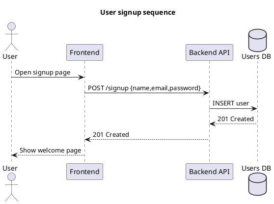

## This is index

```plantuml
@startuml
title User signup sequence
actor User
participant "Frontend" as FE
participant "Backend API" as API
database "Users DB" as DB

User -> FE: Open signup page
FE -> API: POST /signup {name,email,password}
API -> DB: INSERT user
DB --> API: 201 Created
API --> FE: 201 Created
FE --> User: Show welcome page
@enduml

@startuml
title Simple domain class diagram
class User {
  +id: UUID
  +name: String
  +email: String
  +register(): void
}
class AuthService {
  +signup(user: User): User
  +login(email, pass): Token
}
class UserRepository {
  +save(user: User): User
  +findByEmail(email: String): User
}

AuthService --> UserRepository : uses
AuthService --> User : creates
UserRepository o-- "1" User : persists
@enduml
```